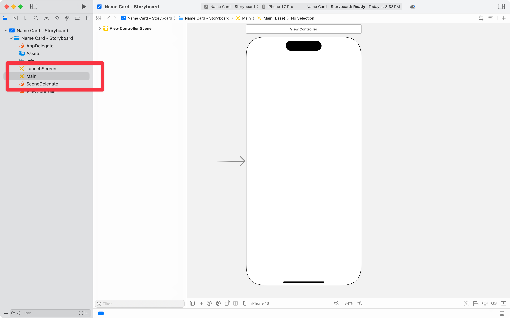
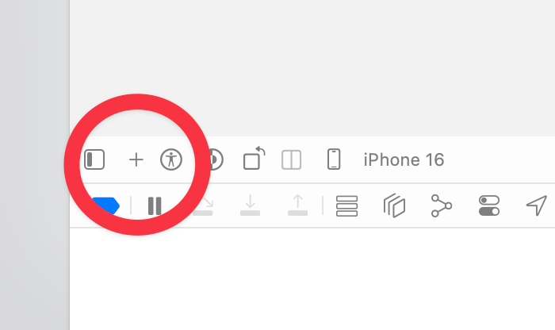
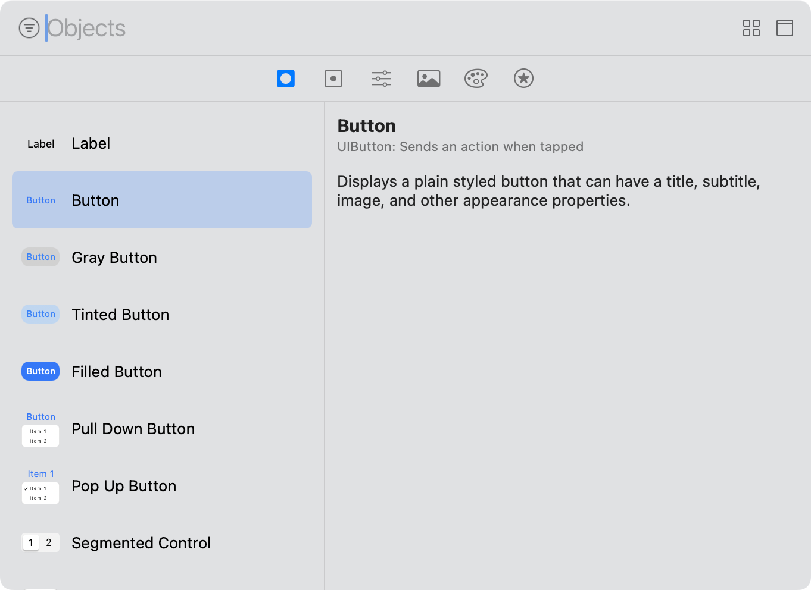
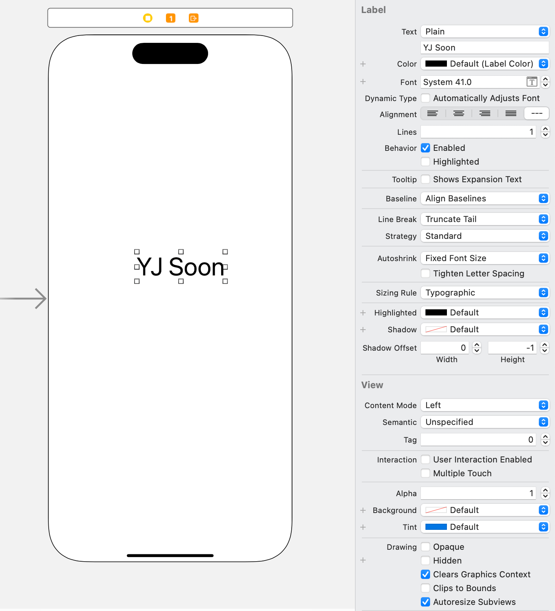
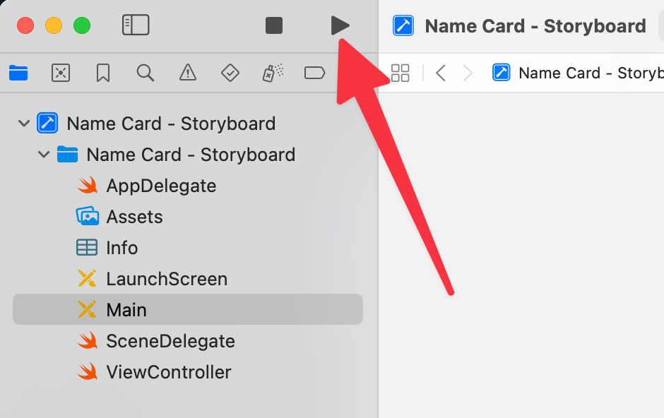
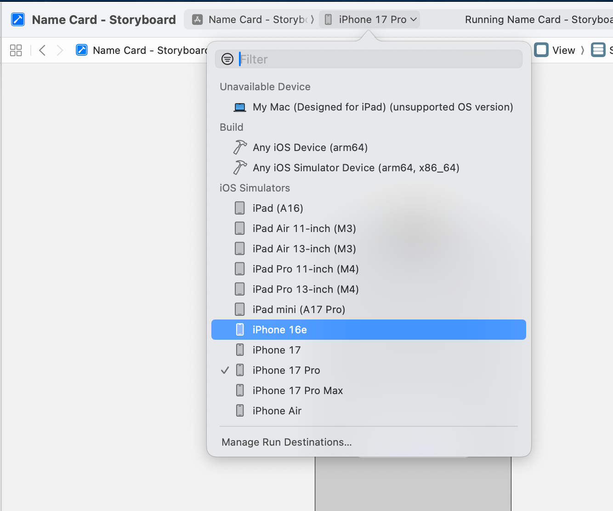
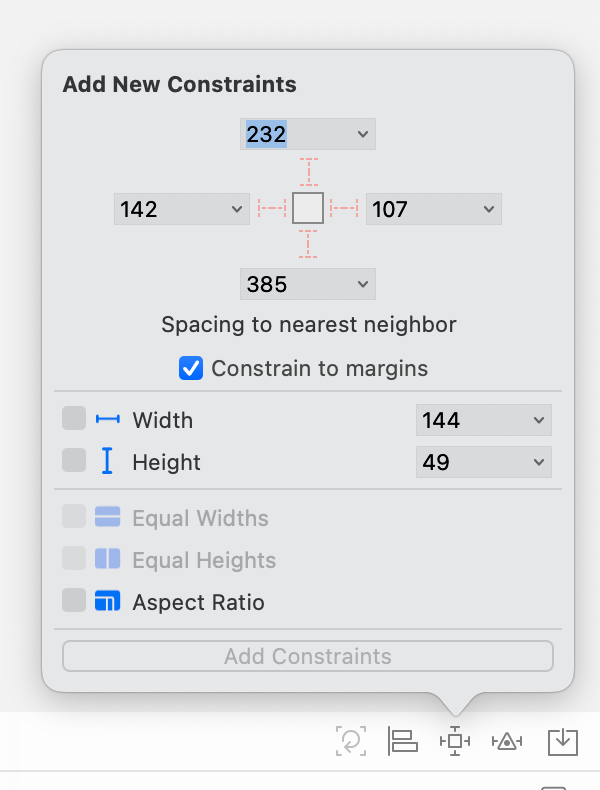
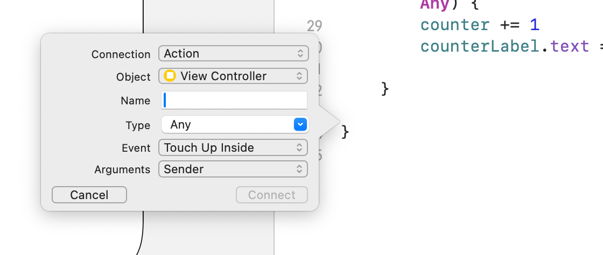
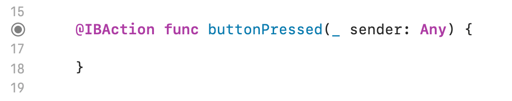

Name Card app, with storyboards
September 30, 2025 12:31 PM

It’s time for our first app! We’ll start by creating a simple “Name card” app that you can… show to people on your phone… instead of giving out as a name card? Yeah, this app isn’t going to make it through App Store Review. 

One thing to note is that we’re going to start by using the drag-and-drop building method known as *storyboards*. 

# Open the storyboard

In the Navigator, look for the item called **Main**, with the yellow “paintbrush X” icon. Click on that *once*.

This opens the **storyboard** — a place where you can put interface elements on your app! 

# Create your interface

Now, let’s add some interface elements! Press the + button in the bottom bar, and you get an Object library.

Click on it to get a list of interface elements you can add. 

Search for, and add the following: 

- 2 `Label`s
- 1 `Image View`
    - You’re going to need to look up how to add images! If you find out, please update this with notes.

When you click on one, you can open up the **Attributes inspector** on the right to adjust things like title, font, alignment, and more. Try it out! Remember to click on the view element, as the inspector updates dynamically based on what’s selected.

Position things properly to set up a “name card” — something that you might use to introduce yourself. Make sure to include: 

- Your name
- A picture of yourself (use the Mac’s built in selfie app, `Photo Booth`, to take a silly image)
- What you do

# Run your app!

Press! Run! … wait a while, for the **Simulator** app to run. 

You can experiment with it, and browse the web on a ridiculously small browser. (Stop that! Get back to work!)

In Xcode, you can choose what device to run by choosing it in the title bar.

If you try running your nicely laid-out app on a device with a different screen scale (e.g. the 17 Pro Max), you may notice that things are out of place. 

# Auto Layout

To fix this, you’ll need to set up **Auto Layout**. 

- **Constraint-based layout system** that automatically positions and sizes UI elements
- **Adapts to different screen sizes and orientations** without hardcoding coordinates
- **Uses relationships between views** (e.g., "20 points from top", "centred horizontally")
- **Replaces manual frame calculations** with flexible, responsive layouts

Think of it as a bunch of simultaneous equations (math!!!!), to try and define where something is on-screen. These will answer a few things: 

- Where is it? Horizontally and vertically.
- How big is it? Width and height.

## How to Auto Layout

Click on the item you want to layout, then look in the bottom right of the storyboard editor:

We’ll work through some examples of how to do Auto Layout in class. 

# Actions and Outlets

Right now, our name card doesn’t…. do anything. It’s not much of an *app*. Let’s make it actually do something, by adding a button that opens up a link to your favourite news site (or whatever it is you use to get news nowadays; I don’t judge). 

- Add a `Button` from the Library.
    - It’s… a piece of blue text. Amazing! You can change the style in the inspector.
- You’ll need to… do some interesting things with ctrl-clicking and dragging between the storyboard editor and the code. This will let you set it up so that clicking on the button will run a function (that’s an `@IBAction`).

Ctrl-click on the button and drag it to below the final }. You should get a pop-up asking you to make an action.

Give it a name, and you should get a function. (More on this later!)

Figure out how to open a new link, and put the code in the function. 

# Exercise submission

Please do up your name card, and submit it here. Make sure that it works on different screen sizes.