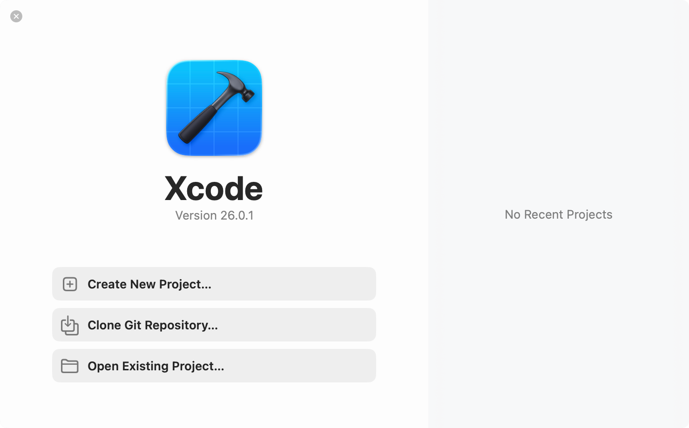
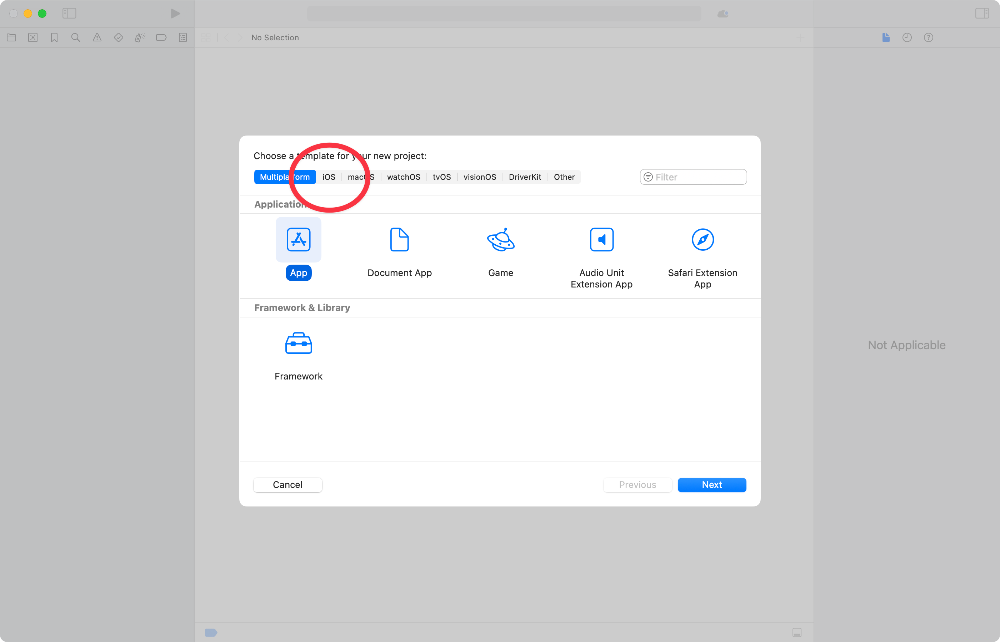
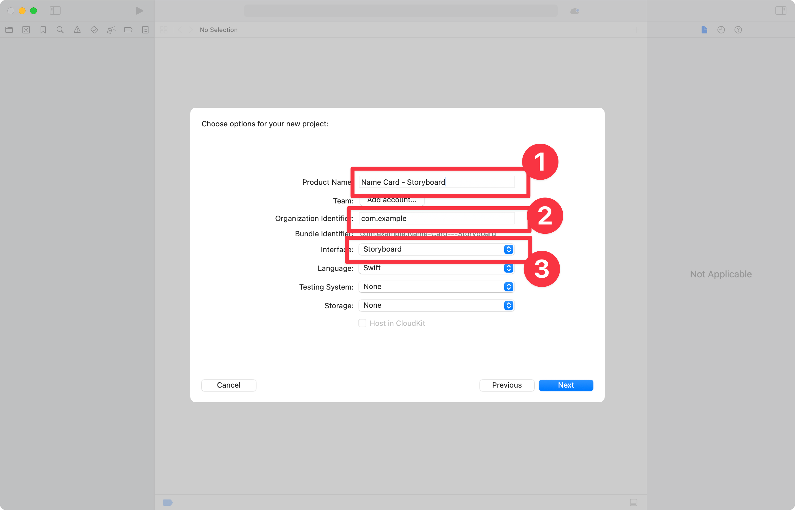
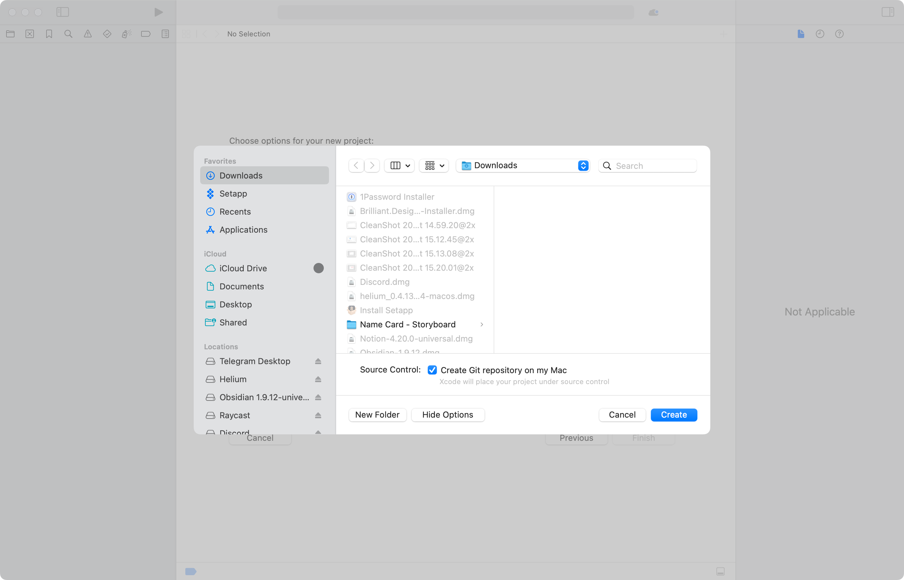
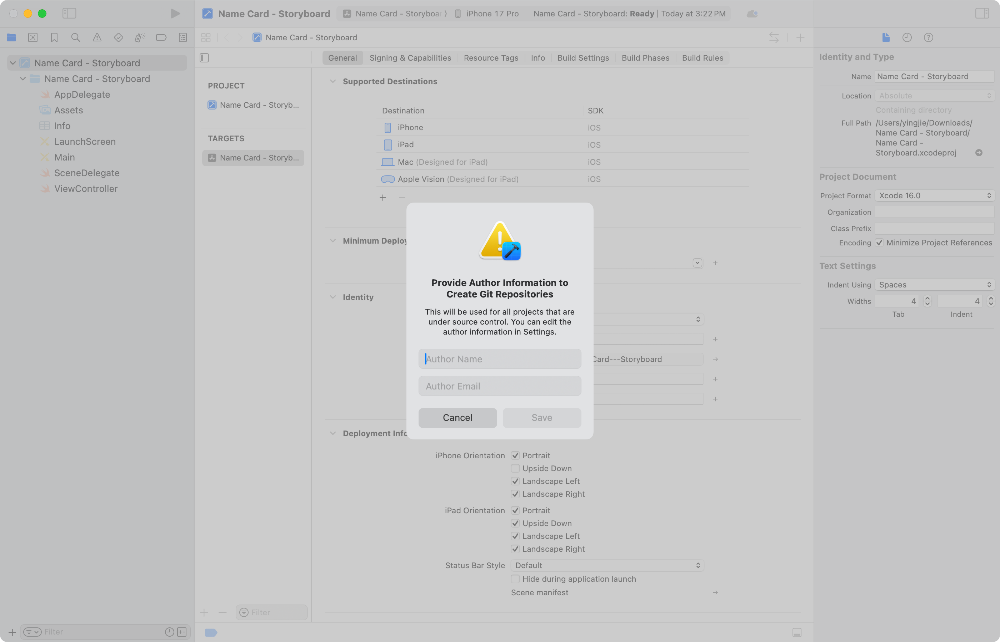
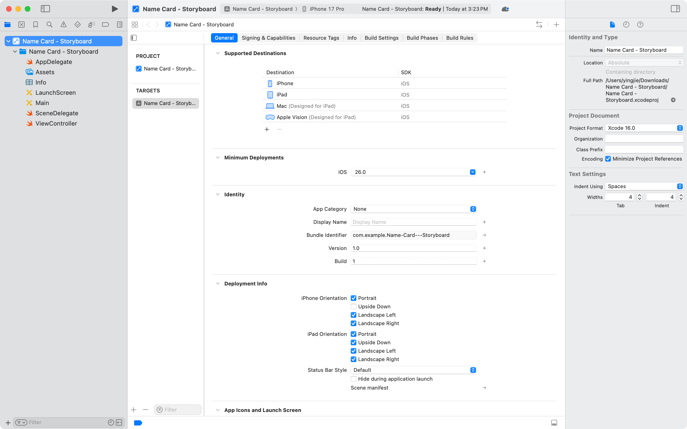
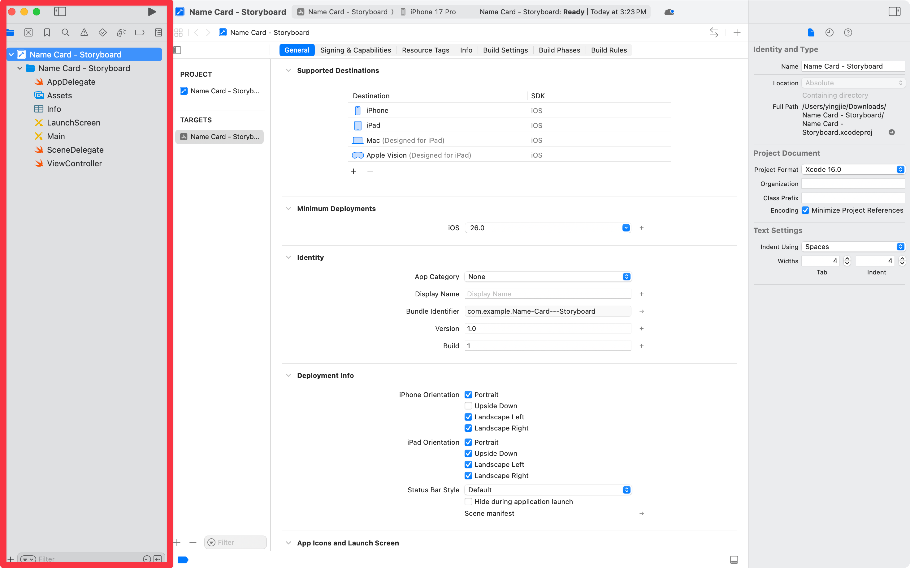
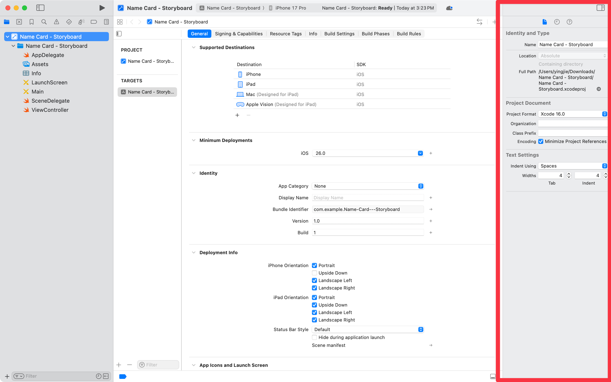

Intro to Xcode
September 29, 2025 9:20 PM

OK, now it’s time for Xcode.

# Getting started

Install Xcode from the App Store

- This is about 5-10GB; it’ll take a while. Hopefully you already have it!
- You can also download it from [developer.apple.com](http://developer.apple.com), but that requires you to log in.
    - No harm signing up for an account now!

# Installing SDKs

Run it once, and download a bunch of stuff! 

- These are the different software development kits (SDKs) that provide the libraries needed for each platform. These include iOS, iPadOS, macOS, visionOS, watchOS, and some other things ending in “OS” I’ve forgotten about.
- Make sure you select the iOS SDK!
- You can grab the Predictive Code Completion stuff, too.
- This is about 8-10GB; it’ll take a while.

# Get started with your first project

This will actually be covered in detail in [Name Card app, with storyboards](https://www.notion.so/Name-Card-app-with-storyboards-27e1ef746aec80fb8aa6f42f5ac341ae?pvs=21), but the goal is to orientate you to Xcode first.

Click on **Create New Project…** to get started.

You’ll see this — *please choose iOS*!

After that, you’ll be asked to give some details.

- Product name: `Name Card - Storyboard`
- Organization Identifier: `com.example` (or anything you want, really)
- Interface: `Storyboard`  - very important!

Save it somewhere. I like having it in my **Downloads** folder. 

- Turn on the checkbox that says **Create Git repository on my Mac**.
- Tip: You can drag a Finder location into this window to set it!

You’ll be asked to provide Author Information since we enabled Git. Enter your name and the email address you use for GitHub. 

And now you have Xcode!

# Xcode orientation

## Navigators

These are the items on the left. 

- You can press `Cmd-0` to `9` to select one of the navigators.
- `0` is reserved for Xcode Code Assist, which only shows up when you’re on macOS 26.
- Press the same keyboard shortcut again to hide the navigator.
- Most of the time, we’ll be in the File Navigator, `Cmd-1`.

## Inspectors

These are the items on the right. 

- You can press `Cmd-Opt-1` to `3` to select one of the navigators.
- Similarly, hide it with the same keyboard combination.
- We’ll probably keep this hidden most of the time, but be aware there are contextual options available.

