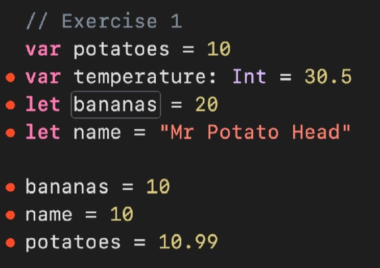
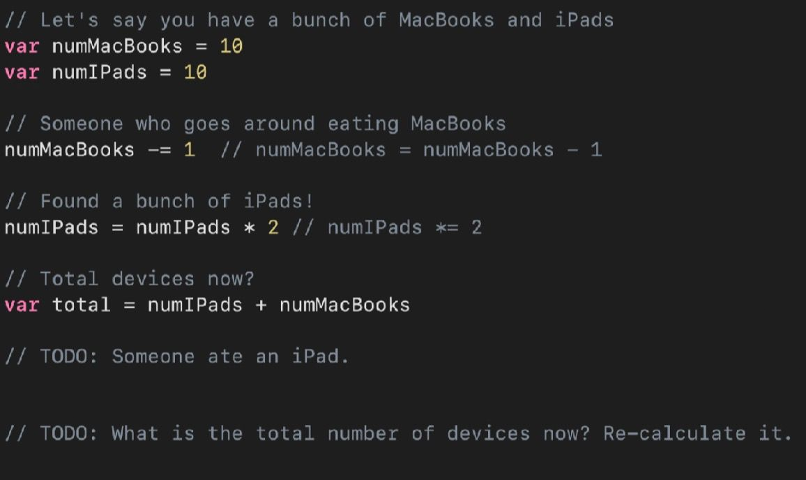
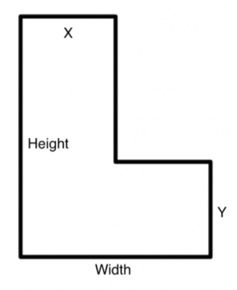
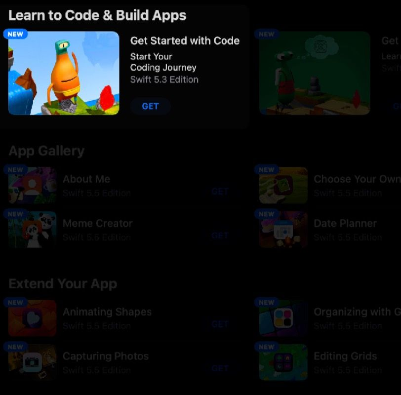

Swift Language 1
September 30, 2025 12:24 PM

In this chapter, we’
ll learn Swift, the programming language.
https://learnxinyminutes.com/swift/

# Intro

## What is Swift?

Swift is a programming language developed by Apple, for use in developing apps for Apple platforms. 

- Released in 2014
- Open sourced in 2015
- Designed to be safe, fast, expressive.

## Swift vs. SwiftUI

- **Swift** is an open-source programming language created by Apple for building apps.
    - Before Swift, Apple developers mostly used another language, Objective-C.
- **SwiftUI** is a user interface toolkit using the Swift language that allows programmers to compose apps on Apple platforms.
    - There are other toolkits still in use, such as AppKit for macOS and UIKit for iOS/iPadOS.

## Getting Started

Create a new Xcode project. No need to remove the storyboard for this — just head straight to `ViewController`. At the top of the file, add:

import Playgrounds

#Playground("Part 1") {
		print("Hello")
}

This is a new feature in Xcode 26 — the `#Playground` macro, which lets you run arbitrary code anywhere. To view the output, open the Preview in the top right. 

Alternatives to `#Playground`:

- Xcode Playgrounds, which you can get to by choosing `File` → `New` → `Playground...`
    - This is a stripped-down version of the Xcode interface, that lets you run code (but not build apps).
- You can also download [Swift Playground for Mac](https://www.notion.so/Swift-Language-1-27e1ef746aec8006be62e090d6cb1a2f?pvs=21)! “Learn real coding the fun way”.
    - This has fun animated puzzles and tutorials to learn Swift and SwiftUI!
## Exercises

There will be exercises throughout this section. Try them out and submit them!

---

# Variables, Constants, and Types

Type in this code. It's OK to get the error!

var numberOfCookies = 10
var myName = "Cookie Monster"
var amIHungry = true

// OM NOM NOM NOM
numberOfCookies = 0

// ME NO LIKE DONUT
let numberOfDonuts = 10

// BUT ME DESPERATE
numberOfDonuts = 5
- In this code, we create some variables and constants, and then we try to change them. In fact, we create three different types of variables/constants.
- `numberOfCookies` is an `Int`, `myName` is a `String`, and `amIHungry` is a `Bool`. More on these later.
- We got some errors — that's fine! Click on the red dots to see more details about the errors.
- There are also some lines, starting with `//`, that don't look like code. Those are **comments**, and are ignored by Swift.

## Naming Variables and Constants

You can store information in variables or constants. Their names:

- Have to start with letters, or an underscore `_`
- Can be emoji, e.g. `var 🍕`, but please don't use emoji variable names unless you want to annoy someone with your code
- Cannot have spaces in them
- Cannot start with numbers
- Are case-sensitive!

We generally name them in **camelCase** — lowercase to start, no space in between words, uppercase for new words.

## Declaring Variables

**Variables:**

- The first time you use one, you have to declare it using the `var` keyword before the name of the variable, e.g. `var numberOfCookies = 10`
- When you want to set it again, you just use the name — no need for `var` this time, e.g. `numberOfCookies = 0`

**Constants:**

- You also have to declare a constant using the `let` keyword, e.g. `let numberOfDonuts = 10`
- You can't change it any more afterwards!
- Think: Why would anyone bother with something so seemingly useless?

## Reserved Keywords

- There are certain things you can't name your variables and constants — these are **reserved keywords** in Swift.
- A reserved keyword is a word that is used in the programming language itself, including keywords used in declarations, statements, expressions and types, patterns and more.
- e.g. `var class = "Secondary 2A"` will return an error, as `class` is a reserved keyword.
- Similarly, you can't name a variable `var`.

**List of Reserved Keywords:** http://tk.sg/swiftreservedkeywords

## Comments

- The grey/faded `//` lines are **comments**
- We saw these in Unit 1 — they're ignored by Swift.
- You can also comment with `/* …anything in between here, even new lines... */`
- Comments are great for writing "notes to yourself", or others
    - Someday, you'll code till 3am, wake up at 8am, look at your code, and wonder, *"What in the world was I thinking??"* — comments would be useful here.
    - Or you might be working in a team, and someone has to take over your code. They'd really appreciate if you could explain what you were trying to do with some complex lines of code!

## Common Variable Types

- **Integer (**`Int`**)** — whole numbers
- **Double-precision floating point numbers (**`Double`**)** — numbers with decimal values (don't use the Float type)
- `String` — text, surrounded by "double quotes"
- **Booleans (**`Bool`**)** — true or false
- … and a few more we might see later.

## Type Inference

- In our example code, we didn't specify a type for any of our variables and constants — Swift cleverly **inferred** the types from what was written.
- `var numberOfCookies = 10` — that's an `Int`, because it has no decimal point.
- `var myName = "Cookie Monster"` — that's a `String`, because of the double-quotes.
- `var amIHungry = true` — that's a `Bool`, because it's `true` or `false` (different from `"true"` or `"false"`, which are Strings!)

## Type Inference (continued)

- What if you wanted to specify a type, though?
- For instance, you want to start `numberOfCookies` at 10, but let it become 0.5 in the future, because you're the kind of person who leaves half a cookie in the jar.
    - (That's terrible.)
- You would have to use **type annotation** to explicitly tell Swift what type the variable you're declaring has.

## Type Annotation

You can annotate each variable declaration with a type, by using a colon, followed by the type name.
var thisIsAnIntBecauseWeSaidSo: Int = 10
var thisIsAnIntBecauseSwiftGuessed = 20
var canYouGuessThisType = 20.5
var wellThisOneIsAnnotated: Double = 100.0
var whatAboutThis = "true"

## Swift and Type Safety, Part 1

- After you declare a variable or constant as a certain type, you cannot change its type ever again!
- In our example code, we couldn't write `numCookies = "no more"`, because that right-side value is a String, and we set `numCookies` up as an Int.
- In fact, Swift won't even let you write `numCookies = 0.5` — because 0.5 is a Double type, not an Int!
- We'll work with different types in the next section.

## Exercise 1

Type out the code shown into your Playground page.

- Don't just use image recognition to lift the text from this image! Type it out so you get used to typing Swift code.
- It'll give you lots of errors!
- Can you fix the code so that Playgrounds doesn't give you any errors? There are many ways to do this.




## Swift and Type Safety, Part 1

- After you declare a variable or constant as a certain type, you cannot change its type ever again!
- In our example code, we couldn't write `numCookies = "no more"`, because that right-side value is a String, and we set `numCookies` up as an Int.
- In fact, Swift won't even let you write `numCookies = 0.5` — because 0.5 is a Double type, not an Int!
- We'll work with different types in the next section.

# Operators

Type out this code. It's a free, gigantic calculator!

You don't have to type the comments. Press run when done!

let sum = 1 + 1
let diff = 5 - 1
let diff2 = 10 - sum // re-using a constant here!

// * is multiply, / is divide
let a = 10
let b = 20
let product = a * b
let div = b / a
let div2 = a / b // wait... my elementary school math teacher might disagree with this result

// % is remainder, or modulo
let rem = 21 % 5 // remainder of 21 when divided by 5

// order of operations is BODMAS, like in real math
var ordered = 5 + 2 * 3

// and you can group with brackets
let output = (5 + 2) * 3

- n this code, we demonstrated some basic mathematical concepts: adding, subtracting, multiplying, dividing, and remainder.
- You can work with numbers, variables, or constants — just remember that constants can't be changed.
- On each line, the left side is the variable or constant, while the right side is an operation. When the operation is complete, the value is assigned into the left.

## Integer Division

- `a` (10) divided by `b` (20) is zero??!?
- Did Apple, the world's biggest company (by market value, at time of writing), fail math when creating Swift?
- Is that why they have so many zeroes behind their value?
- Don't worry: Swift does **integer division**.
- This means that if you divide an integer by another integer, the result is an integer.
- What if you really want to divide an integer variable by a larger integer variable, to get a fraction (or Double)? You'd need to learn about types.

## Swift and Type Safety, Part 2

- Swift is very strict about not mixing types. You saw earlier that you couldn't assign an Int to a Double value.
- This also means you can't add a Double value to an Int! So as odd as it seems, if `a` is an Int, you can't divide it by `2.0` — Swift will give you an error. Test this out:

```swift
let adiv = a / 2.0 ❌
```

- To achieve this, you can **cast** `a` to a Double. This does not change `a`, but it does allow the operation to proceed:

```swift
let adiv = Double(a) / 2.0 ✅
```

## Type Inference Without Variables

- Swift is clever enough to infer the type of any number you type, if it's not part of a declared variable.
- Try these out:

```swift
let test1 = 5 / 2
let test2 = 5.0 / 2
let test3 = 5 / 2.0
```

- There'll be no errors!
- `test1` will be an Int, of value 2, because you divided two Ints.
- `test2` and `test3` will be Doubles, of value 2.5, because Swift assumes each number without `.0` behind it is a Double as well.

## Assignment, Not Equality

Here are some lines of code to type out:

```swift
var cookies = 0
cookies = cookies + 20
cookies += 20

```

- The second line might be a bit confusing if you look at it as a mathematical equation — how can cookies be equal to cookies + 20? 0 ≠ 1! Everything is wrong! — but that's because `=` is an **assignment operator**. It's taking the right side value, and saving it into the left variable.
- The third line is a shorthand for the second! It stands for "increment cookies by 20". You can use this with , , and `/` as well.

## Exercise 2

Changing variables, when there's someone going around eating Apple devices.

Type this out, add in the two missing lines, and try changing your `numMacBooks` and `numIPads`.




# Printing to the Console

```swift
// We can print text
print("Hello world!")

// We can print numbers
print(5)
let c = 10
print(c + 100) // we can print calculated numbers

// We can print string variables with other strings
var fruitSeller = "Amazing Supermart"
var cakeSeller = "Delicious Land"

// Method 1: concatenation
print("I buy all my fruits from " + fruitSeller) // note the space after from

// Method 2: joining
print("I buy all my cakes from", cakeSeller) // no space after from

// Method 3: String interpolation
var dollars = 25000
print("I used to have $\(dollars)...")
print("But I spent it all at \(fruitSeller) and \(cakeSeller).") // 😔

```

## Printing

- How do you print? By calling the `print()` function, and putting what you want to print inside the parentheses.
- We can print numbers, like Ints or Doubles.
- We can print Strings.
- We can put expressions inside, like `a + b`, where `a` and `b` are numbers or text.
- When you write SwiftUI, the things you print show up in the Debug Console in Xcode, and are not visible to the user!
- These can be used to "leave notes to yourself", e.g. checking if a certain line of code is reached.

## Concatenation & Joining

- To join two strings together, you can use **concatenation**, with just a `+` sign between two strings.
    - It won't add a space between the two strings!
    - `print("Water Bottle" + "Pie")` will give `Water BottlePie`.
- Inside a print, you can also use a comma to join two strings.
    - This will leave a space for you!
    - `print("Water Bottle", "Pie")` will give `Water Bottle Pie`.
        - I have no idea what Water Bottle Pie is.

## String Interpolation

- This is our favourite method of putting strings together in Swift.
- **String interpolation**, using `\()`, lets you put variables (or constants) inside a string, and asking Swift to "fill in the blank".
- For instance, if you have a Double variable `r`, you can do:
    - `print("I know that the area of circle with radius \(r)cm is \(3.14159 * r * r)cm squared")` and feel really clever.
- **Tip:** When typing, finish typing `\()` first, before "going back into the brackets" to type your variable. This lets autocomplete do its job inside the brackets!

## Exercise 3

- Create three variables, one for your name, one for your class (a.k.a. "homeroom" or "tutor group"), and one for your hobby.
- Introduce yourself by printing these using string interpolation:

```
My name is Bob.
My class is 8C.
My hobby is Underwater Basket Weaving.
```

- Don't just use `print("My name is Bob.")`! You should be able to adjust the name variable and have the printed output change.
- You may also find out you can't name a variable `class`. Why???

# Functions and Parameters

## Functions

- A **function** is a block of code that performs a specific task.
- Functions have names that describes their purpose, and receive arguments, in the form of parameters, that represent the data given to the function.
- Swift functions with multiple parameters have to be named by default when called.
    - This is different from many languages you might have seen, like JavaScript and C++ (no parameter names), Python (optional parameter names).
- Functions can give back (return) results, or just process data.

Note how the second function has a parameter (`name`). When we call this function, we give it an argument (`"Bobber"`).

```swift
func printIntroduction() {
    print("Hello I am Bob")
    print("My hobby is sleeping")
    print("Bye")
}

printIntroduction() // this is _calling_ the function

func printIntroductionWithName(name: String) {
    print("Hello I am \\(name)") // String interpolation to use the `name` parameter
    print("My hobby is sleeping")
    print("Bye")
}

// calling the function with an argument (or "actual parameter")
printIntroductionWithName(name: "Bobber")

```

## A (very long-named) function that takes in multiple arguments

```swift
func printIntroductionWithNameAndHobbyFor(name: String, hobby: String) {
    print("Hello I am \\(name)")
    print("My hobby is \\(hobby)")
    print("Bye")
}

printIntroductionWithNameAndHobbyFor(name: "Bobbest", hobby: "writing functions")

```

## That Function Name…

- Isn't that function name a bit unwieldy? It has 5 words in the function name!
- Notice that in `printIntroductionWithNameAndHobbyFor`, the latter half is used to describe the variable names
- It'd be great if we can just label the variables instead…

## We can use argument labels

They come before the parameter names. This is fairly unique to Swift!

```swift
func printIntroduction(for name: String, withHobby hobby: String) {
    print("Hello I am \\(name)")
    print("My hobby is \\(hobby)")
    print("Bye")
}

printIntroduction(for: "Bobbestest", withHobby: "writing nicer functions")

```

## Argument Labels

The highlighted words below are **argument labels**. When you call the function, you provide an argument after each.

```swift
func printIntroduction(for name: String, withHobby hobby: String) {
    print("Hello I am \\(name)")
    print("My hobby is \\(hobby)")
    print("Bye")
}

printIntroduction(for: "Bobbestest", withHobby: "writing nicer functions")
```

## Parameter Names

The highlighted words below are **parameter names**. In the function, you use them just like variables. (They are actually constants, not variables!)

```swift
func printIntroduction(for name: String, withHobby hobby: String) {
    print("Hello I am \\(name)")
    print("My hobby is \\(hobby)")
    print("Bye")
}

printIntroduction(for: "Bobbestest", withHobby: "writing nicer functions")

```

## Argument Labels Can Be Blank

If you call your argument label `_`, the user doesn't have to type in a label for that argument. This is useful for making function names readable! Parameter names cannot be blank.

```swift
func printFiveTimesOf(_ num: Int) {
    print(num * 5)
}

printFiveTimesOf(10)
```

## Indentation

- Look carefully at the indentation: everything within the function is indented once (tab key).
- This is not strictly required, though, unlike Python!

## Functions Can Return Values

If you see an arrow after the function name, that means the function returns a value — like a microwave giving you back a cooked parameter. 😋

```swift
// This example from an earlier slide prints out the result
func printFiveTimesOf(_ num: Int) {
    print(num * 5)
}
printFiveTimesOf(10)

// This function _returns_ a value instead, which can be saved in a constant
func returnFiveTimesOf(_ num: Int) -> Int {
    return (num * 5)
}
let result = returnFiveTimesOf(10)
print(result)
```

## Why Return?

- When writing a function, we may want to use a value, computed by a function, to perform other operations.
- For instance, we may want to assign a variable to the value of the result. So this function would not be helpful:

```swift
func multiply(x: Int, y: Int) {
    print(x * y)
}
```

## How to Return?

- Add a `-> Datatype` at the end of the function signature to define the return type, i.e. "what you get back"
- This will allow you to set the returned value to a variable, using the `return` keyword.

```swift
func multiply(x: Int, y: Int) -> Int {
    return x * y
}

var z = multiply(x: 2, y: 5) // z is now 10
```

## When Should a Function Return?

- You don't actually need to use the `return` keyword every time!
- **Implicit return** allows you to return a value without adding the return keyword. Note, though, that implicit returns only work if the function only has 1 line.

```swift
func multiply(x: Int, y: Int) -> Int {
    x * y
}
```

## Exercise 4

- Write a function, `twoNumberStory`, that takes in two parameters (either Int or Double), `first` and `second`, and tells the user a story with the two numbers.
- For example, `twoNumberStory(first: 10, second: 2)` could tell you, with some calculations:

> *Once upon a time, I had 10 potatoes. One day, I ate 2 of them. That left me with 8. I gave them to 4 small children, each of whom ended up with 2 each.*
>

# Conditionals

## Checking for Something

- Let's say you have a function called `adviseWeatherFor(temperature: Double)`, which takes a temperature and advises you on what to wear.
- You'd need an `if` statement that decides what to print:

```swift
if temperature < 10 {
    print("It's so cold! Wear a winter jacket!!")
}
```

- Everything enclosed in curly braces is run if the condition turns out to be true. Look carefully at the indentation that shows what is included in the if statement.

## More Conditions

- On the same example, what if you want to make explicit what to do if the temperature is not less than 10? You can use an `else` statement.

```swift
if temperature < 10 {
    print("It's so cold! Wear a winter jacket!!")
} else {
    print("Just a light jacket will do!")
}

```

- The word `else` can be on its own line, but it's more compact to write it on the same line as the closing curly brace of the if statement.

## Even More Conditions

- How about accounting for more conditions? We can use if-else.

```swift
if temperature < 10 {
    print("It's so cold! Wear a winter jacket!!")
} else if temperature > 30 {
    print("It's so hot! Why go out???")
} else {
    print("Just a light jacket will do!")
}

```

- When Swift evaluates these statements, it goes from top to bottom, and only runs the block where the condition is true. It won't bother with the rest of the statements!

## Specific Comparisons

```swift
if temperature < 10 {
    print("It's so cold! Wear a winter jacket!!")
} else if temperature == 100 {
    print("Is the temperature really the same as boiling water??")
} else if temperature > 30 {
    print("It's so hot! Why go out???")
} else {
    print("Just a light jacket will do!")
}

```

- Notice the use of `==` — that's what Swift (and other languages) use for comparison. `=`, on the other hand, means "assign the right-side value into the left".
- If we changed the order of the second and third conditions, and give a temperature of 100, we'll never get the boil water comment. Any idea why?

## Here's the full code

Including some test cases. It's important to check that your test cases cover all possible paths!

```swift
func adviseWeatherFor(temperature: Double) {
    if temperature < 10 {
        print("It's so cold! Wear a winter jacket!")
    } else if temperature == 100 {
        print("Is the temperature really the same as boiling water??")
    } else if temperature > 30 {
        print("It's so hot! Why go out???")
    } else {
        print("Just a light jacket will do.")
    }
}

adviseWeatherFor(temperature: -10)
adviseWeatherFor(temperature: 5)
adviseWeatherFor(temperature: 40)
adviseWeatherFor(temperature: 15)
adviseWeatherFor(temperature: 100)

```

## Other Comparisons

Here are more numerical comparators:

| Operator | Meaning |
| --- | --- |
| `<` | Less than |
| `<=` | Less than or equal |
| `>` | Greater than |
| `>=` | Greater than or equal |
| `==` | Equal |
| `!=` | Not equal |

```swift
if temperature > 35 {
    print("SO HOT AHHH")
} else if temperature >= 25 {
    print("Kinda warm but alright")
} else if temperature <= 0 {
    print("SO COLD AHHHHH")
} else {
    print("Not bad not bad")
}
```

## Comparing Downwards

- For this example, notice how we compare from the highest temperature — 35 and up — and then go down.
- This lets us segment our conditions, because Swift evaluates conditions from top-to-bottom.
- By the time it reaches the ≥ 25 condition, it's eliminated the possibility that the temperature is > 35.

```swift
if temp > 35 {
    print("SO HOT AHHH")
} else if temp >= 25 {
    print("Kinda warm but alright")
} else if temp <= 0 {
    print("SO COLD AHHHHH")
} else {
    print("Not bad not bad")
}
```

## Booleans

- Remember booleans, or variables/constants of type `Bool`?
- These variables can only be `true` or `false`.
- That's what the expressions after the word `if` are evaluating to, e.g. `temperature > 30` evaluates to `true`.
- You can create booleans directly, too, and evaluate them.

```swift
let isRaining = true
if isRaining {
    print("Bring an umbrella")
}
```

## Boolean Operators

### The && (and) Operator

`x && y`

- Both conditions on the left-hand side and right-hand side of the condition must evaluate to true for the result to be true.

| x | y | result |
| --- | --- | --- |
| true | true | true |
| true | false | false |
| false | true | false |
| false | false | false |

```swift
func useCoffeeMachine(isEmployee: Bool, atLevel3: Bool) {
    if isEmployee && atLevel3 {
        print("You can use the coffee machine.")
    } else {
        print("No coffee machine for you.")
    }
}

```

---

### The || (or) Operator

`x || y`

- Either of the values on the left-hand side or right-hand side of the condition must evaluate to true for the result to be true.

| x | y | result |
| --- | --- | --- |
| true | true | true |
| true | false | true |
| false | true | true |
| false | false | false |

```swift
func getAccess(hasDoorKey: Bool, knowsOverridePassword: Bool) {
    if hasDoorKey || knowsOverridePassword {
        print("Welcome!")
    } else {
        print("Access denied :(")
    }
}

```

---

### The ! (not) Operator

`!x`

- `true` becomes `false`
- `false` becomes `true`

| x | result |
| --- | --- |
| true | false |
| false | true |

```swift
func enforceRules(isWearingMask: Bool, isIndoors: Bool) {
    if isIndoors && !isWearingMask {
        print("Please wear a mask indoors")
    } else {
        print("Either you're outdoors, or wearing a mask indoors. OK!")
    }
}
```

## Exercise 5

- You are given two numbers:

```swift
var a = 5
var b = 20

```

- If any one is divisible by the other, print "divisible".
- Otherwise, print "indivisible".
- Remember the modulo operator? `%`
- Remember to check both ways!

# Practice Problems

A whole bunch of Swift problems for you to try!

## Exercise 6

- Write a simple sum explainer. Your code should start off looking like this, with 2 numbers people can change:

```swift
let number1 = 10
let number2 = 20
```

- And it should output this in the Debug Area, reflecting the numbers typed in:

```
The first number is 10
The second number is 20
The sum of the two numbers is 30
```

- **Bonus:** Can you make sure that your code works, even if someone enters mixed Doubles and Ints?

## Exercise 7

- Set up four variables that describe the L-shape shown to the right:

```swift
var width = 20
var height = 40
var x = 5
var y = 6
// Work out the area! Should be 290.
```

- Can you write a program to print out the resultant area?


## Exercise 8

- With a variable called `input` that's a multi-digit integer, find the last digit.
- For example, if `input` is 1005, your code should print out "The last digit is 5".
- If `input` is 990202420, your code should print out "The last digit is 0".

## Exercise 9

- `x` years from now, Alice will be `y` times older than her brother, Bobo.
- Set up a program that calculates how old Alice is, if we define 3 things: `x`, `y`, and `boboAge`.
- E.g. if Bobo is 12 years old now, x is 3, and y is 2, then Alice is 27 years old now.

## Exercise 10 Part 1

- Make a function, `calculateBMI(weight: Double, height: Double)`
- **Arguments:** Two variables, weight (in kg) and height (in m).
- **Prints out:** Your BMI.

## Exercise 10 Part 2

- Edit your function, `calculateBMI(weight, height)`
- If you give it a BMI in the healthy range (18.5 to 24.9, according to the World Health Organisation), your code prints **Healthy**
- If below, prints **Underweight**
- If above, prints Overweight

#Playground("Exercise 1") {
    var potatoes: Double = 10
    var temperature: Double = 30.5
    var banans = 20
    var name = "Mr Potato Head"
    
    banans = 10
    name = "Xf"
    potatoes = 10.99
}
#Playground("Exercise 2"){

    var numMacBooks = 10
    var numIPads = 10
    
    numMacBooks -= 1
    numIPads = numIPads * 2
    
    var total = numIPads + numMacBooks
    print(total)
    numIPads -= 1
    
    total = numIPads + numMacBooks
    print(total)
}
#Playground("Exercise 3"){
    var name = "XF"
    var classs = "73-02-05"
    var hobby = "playing game"
    
    print("My name is", name)
    print("My class is",classs)
    print("My hibby is",hobby)
}
#Playground("Exercsie 4"){
    func twoNumberStory(first: Double, second: Double){
        var remainder = first - second
        var Children = 4
        var Each = remainder / 4
        print("Once upon a time, I had \(Int(first)) potatoes. One day, I ate \(Int(second)) of them. That left me with \(Int(remainder)). I gave them to \(Int(Children)) small children, each of whom ended up with \(Int(Each)) each.")
    }
    twoNumberStory(first: 10, second: 2)
}
#Playground("Exercise 5")
{
    var a = 5
    var b = 20
    
    if a % b == 0 || b % a == 0 {
        print("divisible")
    } else {
        print("indivisible")
    }
}#Playground("Exercise 6")
{
    let number1 = 10
    let number2 = 20
    
    var sum = number1 + number2
    
    print("The first number is", number1)
    print("The second number is", number2)
    print("The sum of the two is", sum)
}
#Playground("Exercise 7")
{
    var width = 20
    var height = 40
    var x = 5
    var y = 6
    
    var area = (height - y) * x + y * width
    print("Area: \(area)")
}
#Playground("Exercise 8")
{
    var input = 1005
    func findlastdigit(for num: Int)
    {
        print("last digit is \(num % 10)")
    }
    findlastdigit(for: input)
}
#Playground("Exercise 9")
{
    var x = 3
    var y = 2
    var bobo = 12
    var Alice1 = (bobo + x) * y
    var Alice = Alice1 - x
    print("Alice currently\(Alice) years old")
}
#Playground("Exercise 10") {
    func calculateBMI(weight: Double, height: Double) {
        let bmi = weight / pow(height, 2)
        if (bmi < 18.5) {
            print("Underweight")
        } else if (bmi > 24.9) {
            print("Overweight")
        } else {
            print ("Healthy")
        }
    }
    calculateBMI(weight: 100, height: 1.82)
}


# Playgrounds Puzzles

## Learn To / Get Started with Code

- Swift Playgrounds offers a series of light-hearted introductory coding lessons and exercises.
- Features lovable  characters who respond to code commands, like `moveForward()` and `collectGem()`
- **Get Started with Code** is a quick introduction. Try this first; more on next slide.
- **Learn To Code 1 & 2** are longer and go into more detail. Try these if you have time!




## Get Started with Code

- Get it from the **Learn to Code** section — click on **Get**, then go back to the previous screen to open it.
- Topics covered more or less overlap with this unit:
    - Commands, For Loops*, Conditionals, Logical Operators, Variables, Types*, Initialisation, Functions, Parameters
    - We'll cover for loops and types in more detail in a later unit, but they're quite easy in the Playground!

## What Haven't We Covered?

- From the basics:
    - **Loops.** We haven't done for or while loops yet, though you may encounter for-loops in the Playgrounds puzzles.
    - **Arrays.** Data in sequence, which usually shows up with loops.
- Intermediate Swift: Enumerations, dictionaries, closures, optionals, tuples, and many more.


Stuff typed in class
//
//  ViewController.swift
//  Swift Language 1
//
//  Created by YJ on 1/10/25.
//

import UIKit

class ViewController: UIViewController {
    
    override func viewDidLoad() {
        super.viewDidLoad()
        // Do any additional setup after loading the view.
        
    }
    
}

import Playgrounds

#Playground("Variables and constants") {
    
    var numberOfCookies = 10 // Int with type annotation
    var myName = "YJ" // String
    var amIHungry = true // Bool
    var pi = 3.14159 // Double
    
    //numberOfCookies = 9.5 // cannot assign Double to Int
    
    let numberOfDonuts = 10 // constant
    //    numberOfDonuts = 5
    
    //    var var = 1
    
    /*
     This is a multi line comment
     */
}

#Playground("Operators") {
    let sum = 1 + 1
    let diff = 5 - 1
    let diff2 = diff - sum
    let a = 10
    let b = 20
    let product = a * b
    
    let div = b / a
    let div2 = a / b // Cast to an Int after division
    
    let remainder = 21 % 5
    
    let ordered = 5 + 2 * 3
    // 5+2 might be an error
    let ordered2 = (5 + 2) * 3
    
    var x = 5
    x += 1
    // x++ -- removed this in Swift 2.0
    
    // Types
    let anInt = 100
    let result = anInt / 2 // no problem
    //    let result2 = anInt / 2.0 // TOTALLY ILLEGAL CANNOT
    let result2 = Double(anInt) / 2.0 // casting to Double
    
    let test1 = 5 / 2
    let test2 = 5.0 / 2
    let test3 = 5 / 2.0
}

#Playground("Printing") {
    print("Hello world")
    print(10)
    let c = 100
    print(c + 100)
    
    let fruitSeller = "Don Don Donki"
    let cakeSeller = "Swee Heng"
    
    // Method 1: Concatenation
    print("I buy all my fruits from " + fruitSeller)
    // Method 2: Joining
    print("I buy all my pastries from", cakeSeller)
    // Method 3: String interpolation
    let dollars = 3000
    print("I used to have $\(dollars)...")
    print("But I spent it all at \(fruitSeller) and \(cakeSeller)")
}

#Playground("Functions") {
    
    // No parameters
    func printIntro() {
        print("Hello I am YJ")
        print("My hobby is printing things")
    }
    
    printIntro()
    
    // One named parameter
    func printIntroWithName(name: String) {
        print("Hello I am \(name)")
        print("My hobby is printing things with arguments")
    }
    
    printIntroWithName(name: "YJ")
    
    // Two named params
    func printIntroWithNameAndHobby(name: String, hobby: String) {
        print("Hello I am \(name)")
        print("My hobby is \(hobby)")
    }
    
    printIntroWithNameAndHobby(name: "YJ", hobby: "autocompleting when it works")
    
    // Function name was stupidly long
    func printIntro(name: String, hobby: String) {
        print("Hello I am \(name)")
        print("My hobby is \(hobby)")
    }
    
    // With argument labels
    func printIntro(for name: String, withHobby hobby: String) {
        print("Hello I am \(name)")
        print("My hobby is \(hobby)")
    }
    
    printIntro(for: "YJ", withHobby: "writing fancy function calls")

    // Blank argument labels
    func printFiveTimesOf(_ num: Int) {
        print(num * 5)
    }
    
    printFiveTimesOf(200)
    
    // Returning values
    func fiveTimesOf(_ num: Int) -> Int {
//        return (num * 5)
//        return num * 5
        num * 5

    }
    let result = fiveTimesOf(600)
    print(result)
    
}

#Playground("Conditionals") {
    
    func adviseWinterClothingFor(temperature: Double) {
        if temperature < 10 {
            print("Wear a winter jacket")
        } else if temperature > 30 {
            print("Siao ah, what jacket")
        } else if temperature == 100 {
            print("Die already lah")
        } else {
            print("No need but up to you")
        }
    }
    
    adviseWinterClothingFor(temperature: 18)
    
    let isRaining = true
    
    if isRaining {
        print("Bring an umbrella")
    }
    
    let isSunny = true
    
    if isRaining || isSunny { // or is ||
        print("Welcome to Singapore")
    }
    
    if isRaining && isSunny { // and is &&
        print("Look for a rainbow")
    }
    
    if !isSunny {
        print("Good, it's not sunny")
    }
    
}
