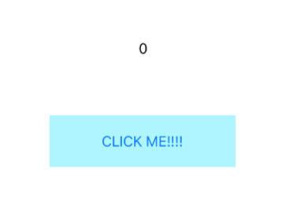
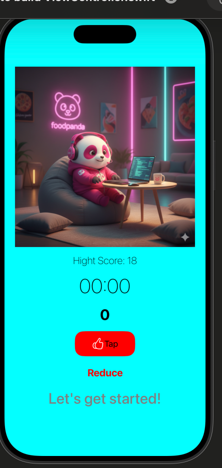

Counter
October 1, 2025 1:14 PM


# What you’re building

We’re making a simple interactive counter that we can extend later on.

- On-screen counter
- Button to press
- After pressing the button, the number increases
- Once the number passes a certain figure, there are messages that show up

And some possible extensions: 

- A timer — make this into a game where your user needs to tap a certain number of taps at one go
- A competitive tapping game — have two parts of the screen where different players tap to increase their scores
- Any kind of output where a variable controls how something is rendered on screen.


# Checkpoint 1: Getting set up

- Create a new project, called Counter
- Set up the screen as shown, with one `UILabel` and `UIButton` , preferably in a `UIStackView`
- Set up a variable in the main `class` to track the current number — call it `counter` perhaps
- When the button is pressed, increment `counter`, and update the counter label




- That’s it for the first checkpoint! When you’re done, press the button below, and enter your name.
- Optional:
    - Add button to reduce number
    - Add button to set to zero
    - These buttons should only show up when the number is not 0

# Checkpoint 2: Add encouraging message

- Add another `UILabel`, that’s initially hidden.
- When the user taps on the button enough times (10?), have an encouraging message pop up that says “Keep going!”
    - Alternatively, feel free to insult the user for having nothing better to do.
- Add a few more conditionals for when the user taps 15, 20, 25 times.

# Checkpoint 3: Animations!

- Now it’s time to add animations! Here’s how it works:

```swift
UIView.animate(withDuration: 3.0) {
		// change a property in here, and it'll be automatically animated
}
```

- This is an example of a *closure*, which we’ll learn more about later.
- Animatable properties are: `transform`, `alpha`, `backgroundColor` — things that aren’t affected by Auto Layout! If you want to change position, you’ll need to create some kind of variable for the constraint’s constant value, and change *that*.
- Try setting it up so that the button fades out to transparent each time you click on it, or by using `transform.rotated` to turn the number around as you press.

# Checkpoint 4: Timer version with high score

- We’re now going to make this into a timed game — how long does it take to tap 30 times?
    - Or maybe how many taps can someone make in 30 seconds?
    - We’ll start with the first version; you can try adapting to the second later.
- Allow the user to end the game after a fixed number of taps (e.g. 30).
    - After they’re done, update your second label with the time they took.
- You’ll want to set the button to `.disabled`, and update its `.title` to “Finished”.
- Create a `Timer` and a `timeElapsed` variable to track how long it’s been since the game started.
    - You’ll actually need to make a `Timer?`, because you can’t declare uninitialised properties. This is an optional `Timer`, just be aware to use its name with a `?` at the end.
    - You’ll need to look up how to use `Timer` and you may run into interesting asides about closures, `self`, memory management, and more. Note these down for discussion!
- Add a **Reset** button so your user can try again!
- Add a variable for `highScore` to store the current high score.
    - Start it at 0, and compare it against the current score each time to save it.
    - After that, though, you’ll need to make sure this *persists* across app shutdowns and restarts. To do that, look into something called `UserDefaults` , to try and save the score.
- When you’re done, submit below — preferably with a demo video!




import UIKit

class ViewController: UIViewController {

    let label = UILabel()
    let label2 = UILabel()
    let button = UIButton()
    let reduceButton = UIButton()
    let resetButton = UIButton()
    let stackView = UIStackView()
    let timeLabel = UILabel()
    var counter = 0
    var time: Timer?
    var seconds = 0
    
    let highScorelabel = UILabel()
    var hightScore = 0
    let defaults = UserDefaults.standard
    let highScoreKey = "highScoreValue"
    
    override func viewDidLoad() {
        super.viewDidLoad()
        // Do any additional setup after loading the view.
        hightScore = defaults.integer(forKey: highScoreKey)
        view.backgroundColor = .cyan
        setUI()
        setLayout()
    }
    
    private func setUI(){
        stackView.axis = .vertical
        stackView.spacing = 15
        stackView.alignment = .center
        stackView.translatesAutoresizingMaskIntoConstraints = false
        view.addSubview(stackView)
        
        label.text = counter.description
        label.font = .systemFont(ofSize: 30, weight: .bold)
        label.textColor = .black
        label.textAlignment = .center
        label.translatesAutoresizingMaskIntoConstraints = false
        
        
        highScorelabel.text = "Hight Score: \(hightScore)"
        highScorelabel.font = .systemFont(ofSize: 20, weight: .thin)
        highScorelabel.textColor = .black
        highScorelabel.textAlignment = .center
        highScorelabel.translatesAutoresizingMaskIntoConstraints = false
        
        
        label2.text = "Let's get started!"
        label2.font = .systemFont(ofSize: 30, weight: .medium)
        label2.textColor = .black
        label2.textAlignment = .center
        label2.translatesAutoresizingMaskIntoConstraints = false
        //view.addSubview(label)
        
        
        timeLabel.text = "00:00"
        timeLabel.font = .systemFont(ofSize: 40, weight: .thin)
        timeLabel.textColor = .black
        timeLabel.textAlignment = .center
        timeLabel.translatesAutoresizingMaskIntoConstraints = false
        

        button.setTitle("Tap", for: .normal)
        button.tintColor = .red
        button.configuration = .filled()
        button.setImage(UIImage(systemName: "hand.thumbsup"), for: .normal)
        button.setTitleColor(.black, for: .normal)
        button.layer.cornerRadius = 10
        button.titleLabel?.font = .systemFont(ofSize: 20, weight: .bold)
        button.translatesAutoresizingMaskIntoConstraints = false
        
        button.addTarget(self, action: #selector(buttonTapped), for: .touchUpInside)
        
        
        reduceButton.setTitle("Reduce", for: .normal)
        reduceButton.setTitleColor(.red, for: .normal)
        reduceButton.titleLabel?.font = .systemFont(ofSize: 20, weight: .bold)
        reduceButton.translatesAutoresizingMaskIntoConstraints = false
        
        reduceButton.addTarget(self, action: #selector(reduceTapped), for: .touchUpInside)
        
        
        resetButton.setTitle("Rest", for: .normal)
        resetButton.setTitleColor(.red, for: .normal)
        resetButton.titleLabel?.font = .systemFont(ofSize: 20, weight: .bold)
        resetButton.translatesAutoresizingMaskIntoConstraints = false
        resetButton.isHidden = true
        resetButton.addTarget(self, action: #selector(resetTapped), for: .touchUpInside)
        
        
        
//        button.addAction(UIAction{_ in buttonTapped(), for: .touchUpInside)
        
        stackView.addArrangedSubview(highScorelabel)
        stackView.addArrangedSubview(timeLabel)
        stackView.addArrangedSubview(label)
        stackView.addArrangedSubview(button)
        stackView.addArrangedSubview(reduceButton)
        
        stackView.addArrangedSubview(label2)
        stackView.addArrangedSubview(resetButton)
        
    }
    
    @objc private func buttonTapped(){
        counter += 1
        label.text = counter.description
        updateButtonVisibity()
        updateLabel2()
        
        if counter > hightScore{
            hightScore = counter
            highScorelabel.text = "High Score: \(hightScore)"
            defaults.set(hightScore, forKey: highScoreKey)
        }
        
        
        if counter == 1 {
            time = Timer.scheduledTimer(timeInterval: 1.0, target: self, selector: #selector(onTimerFires), userInfo: nil, repeats: true)
        }
        
        
        
        UIView.animate(withDuration: 0.3) {
            self.button.alpha = 0.5
            self.button.transform = .identity.scaledBy(x: 0.4, y: 0.4)
            self.button.transform = self.button.transform.rotated(by: CGFloat.pi / 2)
        }
        UIView.animate(withDuration: 0.3){
            self.button.alpha = 1.0
            self.button.transform = .identity.scaledBy(x: 1, y: 1)
            self.button.transform = .identity
        }
        
    }
    
    @objc private func onTimerFires(){
        seconds += 1
        timeLabel.text = formatTime(from: seconds)
    }
    
    @objc private func reduceTapped(){
        if counter > 0{
            counter -= 1
            label.text = counter.description
            updateLabel2()
            UIView.animate(withDuration: 0.3){
                self.view.backgroundColor = .red
            }
            UIView.animate(withDuration: 0.3){
                self.view.backgroundColor = .cyan
            }
        }
    }
    
    @objc private func resetTapped(){
        counter = 0
        label.text = counter.description
        
        time?.invalidate()
        time = nil
        seconds = 0
        timeLabel.text = "00:00"
        updateButtonVisibity()
        updateLabel2()
    }
    
    private func formatTime(from totalSeconds: Int) -> String {
        let minutes = totalSeconds / 60
        let seconds = totalSeconds % 60
        return String(format: "%02d:%02d", minutes, seconds)
    }
    
    private func updateButtonVisibity(){
        //if the counter is 0 the button will be hiden
        //if is anything else it will be bisible.
        if counter > 0{
            resetButton.isHidden = false
        }else{
            resetButton.isHidden = true
        }
    }
    

    private func updateLabel2(){
        switch counter{
        case 0:
            label2.text = "Let's get started!"
            label2.textColor = .gray
        case 1:
            label2.text = "One tap and you're good to go!"
            label2.textColor = .brown
        case 10:
            label2.text = "keep going!"
            label2.textColor = .yellow
        case 15:
            label2.text = "almost there!"
            label2.textColor = .green
        case 20:
            label2.text = "You did it!"
            label2.textColor = .black
        case 25:
            label2.text = "You're a pro!"
            label2.textColor = .blue
        default:
            label2.text = "don't give up!"
            label2.textColor = .red
        }
    }
    
    private func setLayout(){
        NSLayoutConstraint.activate([
            stackView.centerXAnchor.constraint(equalTo: view.centerXAnchor),
            stackView.centerYAnchor.constraint(equalTo: view.centerYAnchor),
            stackView.widthAnchor.constraint(equalTo: view.widthAnchor, multiplier: 1),
            button.widthAnchor.constraint(equalTo: stackView.widthAnchor, multiplier: 0.3),
            button.heightAnchor.constraint(equalToConstant: 50)
        ])
    }

}

#Preview{
    ViewController()
}


class ViewController: UIViewController {
    
    let stackView = UIStackView()
    let timesEatenLabel = UILabel()
    let timesEatenNumberLabel = UILabel()
    let timesEatenStack = UIStackView()
    let eatButton = UIButton()
    var timesEaten: Int = 0
    let encouragingLabel = UILabel()
    
    var timer: Timer?
    var timeElapsed: Double = 0
    let timerLabel = UILabel()
    
    let winningImageView = UIImageView()
    let resetButton = UIButton()
    
    var highScore: Double = 0
    let highScoreLabel = UILabel()
    let defaults = UserDefaults.standard
    

    override func viewDidLoad() {
        super.viewDidLoad()
        // Do any additional setup after loading the view.
        view.backgroundColor = .systemPink
        if let oldHighScore = defaults.value(forKey: "highScore") as? Double {
            highScore = oldHighScore
        }
        setupUI()
        setupLayout()
    }

    private func setupUI() {
       
        
        //Stack view
        stackView.translatesAutoresizingMaskIntoConstraints = false
        stackView.axis = .vertical
        stackView.alignment = .center
        stackView.spacing = 20
        view.addSubview(stackView)
        
        //high score label
        highScoreLabel.text = formatTimeString(label: "High Score", time: highScore)
        highScoreLabel.textColor = .white
        highScoreLabel.font = .systemFont(ofSize: 30, weight: .semibold)
        stackView.addArrangedSubview(highScoreLabel)
        
        //timer label
        timerLabel.text = formatTimeString(label: "Timer", time: timeElapsed)
        timerLabel.textColor = .white
        timerLabel.font = .italicSystemFont(ofSize: 20)
        timerLabel.isHidden = true
        stackView.addArrangedSubview(timerLabel)
        
        //times eaten stack
        timesEatenStack.translatesAutoresizingMaskIntoConstraints = false
        timesEatenStack.axis = .horizontal
        timesEatenStack.alignment = .center
        timesEatenStack.spacing = 15
        stackView.addArrangedSubview(timesEatenStack)
        
        //Label
        timesEatenLabel.text = "Times eaten:"
        timesEatenLabel.font = .systemFont(ofSize: 40, weight: .bold)
        timesEatenLabel.textColor = .white
        timesEatenStack.addArrangedSubview(timesEatenLabel)
        
        //times eaten number label
        timesEatenNumberLabel.text = "\(timesEaten)"
        timesEatenNumberLabel.font = .systemFont(ofSize: 40, weight: .bold)
        timesEatenNumberLabel.textColor = .white
        timesEatenStack.addArrangedSubview(timesEatenNumberLabel)
        
        // Button
        eatButton.setTitle("Eat!!!", for: .normal)
        eatButton.setTitleColor(.white, for: .normal)
        eatButton.configuration?.titlePadding = 8
        eatButton.configuration = .glass()
        eatButton.configuration?.buttonSize = .large
        eatButton.addTarget(self, action: #selector(increaseEatCount), for: .touchUpInside)
        
        stackView.addArrangedSubview(eatButton)
        
        //winning image
        winningImageView.image = UIImage(named: "star cat")
        winningImageView.contentMode = .scaleAspectFit
        winningImageView.translatesAutoresizingMaskIntoConstraints = false
        winningImageView.isHidden = true
        stackView.addArrangedSubview(winningImageView)
        
        //reset button
        resetButton.setTitle("Reset", for: .normal)
        resetButton.setTitleColor(.white, for: .normal)
        resetButton.configuration?.titlePadding = 8
        resetButton.configuration = .glass()
        resetButton.configuration?.buttonSize = .large
        resetButton.addTarget(self, action: #selector(reset), for: .touchUpInside)
        resetButton.isHidden = true
        
        stackView.addArrangedSubview(resetButton)
        
        //Encouraging Label
        encouragingLabel.text = "Eat moreeeeee!"
        encouragingLabel.font = .systemFont(ofSize: 20, weight: .regular)
        encouragingLabel.textColor = .white
        encouragingLabel.isHidden = true
        encouragingLabel.translatesAutoresizingMaskIntoConstraints = false
        view.addSubview(encouragingLabel)
        
    }
    
    private func setupLayout() {
        NSLayoutConstraint.activate([
            encouragingLabel.bottomAnchor.constraint(equalTo: view.safeAreaLayoutGuide.bottomAnchor, constant: -20),
            encouragingLabel.centerXAnchor.constraint(equalTo: view.centerXAnchor),
            stackView.centerXAnchor.constraint(equalTo: view.centerXAnchor),
            stackView.centerYAnchor.constraint(equalTo: view.centerYAnchor),
//            stackView.topAnchor.constraint(equalTo: view.safeAreaLayoutGuide.topAnchor, constant: 40),
//            stackView.bottomAnchor.constraint(equalTo: view.safeAreaLayoutGuide.bottomAnchor, constant: -80),
//            winningImageView.bottomAnchor.constraint(equalTo: view.safeAreaLayoutGuide.bottomAnchor, constant: -20),
            winningImageView.leadingAnchor.constraint(equalTo: view.leadingAnchor, constant: 50),
            winningImageView.trailingAnchor.constraint(equalTo: view.trailingAnchor, constant: -50),
            winningImageView.heightAnchor.constraint(equalToConstant: 250)
        ])
    }
    
    @objc private func increaseEatCount() {
        if (timesEaten == 0) {
            startTimer()
        }
        timesEaten += 1
        timesEatenNumberLabel.text = "\(timesEaten)"
        if timesEaten == 20 {
            encouragingLabel.isHidden = false
        } else if timesEaten == 30 {
            encouragingLabel.text = "You're a true foodie!!"
        } else if timesEaten == 50 {
            encouragingLabel.text = "You can be a mukbang star!!"
            timer?.invalidate()
            timer = nil
            handleEnd()
        }
        animateNumber()
    }
    
    private func animateNumber() {
        UIView.animate(withDuration: 0.5) {
            self.timesEatenNumberLabel.transform = self.timesEatenNumberLabel.transform.rotated(by: .pi)
        }
    }
    
    private func startTimer() {
        timer?.invalidate()
        timeElapsed = 0
        timerLabel.isHidden = false
        
        timer = Timer.scheduledTimer(withTimeInterval: 0.01, repeats: true, block: { [weak self] _ in
            self?.updateTimer()
        })
    }
    
    private func updateTimer() {
        timeElapsed += 0.01
        
        timerLabel.text = formatTimeString(label: "Timer", time: timeElapsed)
    }
    
    private func formatTimeString(label: String, time: Double) -> String {
        let minutes = Int(time) / 60
        let seconds = time.truncatingRemainder(dividingBy: 60)
        
        return String(format: "\(label): %02d:%05.2f", minutes, seconds)
    }
    
    private func handleEnd() {
        UIView.animate(withDuration: 0.5) {
            self.winningImageView.isHidden = false
            self.timesEatenNumberLabel.isHidden = true
            self.timesEatenLabel.isHidden = true
            self.eatButton.isHidden = true
            self.timerLabel.font = .systemFont(ofSize: 28, weight: .bold)
            self.resetButton.isHidden = false
        }
        
        if highScore == 0 || timeElapsed < highScore {
            highScore = timeElapsed
            defaults.set(highScore, forKey: "highScore")
            highScoreLabel.text = formatTimeString(label: "High Score", time: highScore)
        }
            
    }
    
    @objc private func reset() {
        timesEaten = 0
        timesEatenNumberLabel.text = "\(timesEaten)"
        timerLabel.isHidden = true
        winningImageView.isHidden = true
        timesEatenLabel.isHidden = false
        timesEatenNumberLabel.isHidden = false
        eatButton.isHidden = false
        encouragingLabel.isHidden = true
        resetButton.isHidden = true
    }
    
}

# Project!

- Now it’s your turn! Try making your own counter. There’s a lot that can be done with this simple codebase.
- First, though, you might want to duplicate your project — copy and paste the entire project (the folder above the `xcodeproj`) and edit that one.
