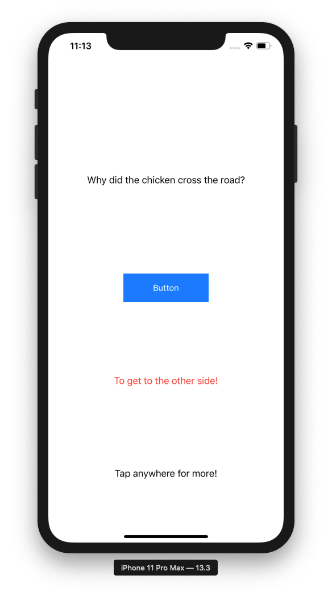

Dad Jokes
October 2, 2025 11:43 AM

# Intro

- In this project, you’ll make an array- and struct-based app to display dad jokes one by one.
- We’ll build an array of `Joke`s to be displayed on screen.
- There’ll also be some concepts of navigation — having a separate ViewController to display.
- Please supply your own terrible jokes (or ask an AI to do it for you).
    - Here’s one list: https://www.countryliving.com/life/a27452412/best-dad-jokes/


# Checkpoint 1: Setting up

- Make a new project, and get rid of storyboards
- Add 3 labels and a button, as shown →
- Set the number of lines for the labels to `0`
- Suggested naming: `setupLabel`, `whatButton`, `punchlineLabel`, `continueLabel`
- Set up the button with an action, `whatButtonPressed`


# Checkpoint 2: Set up your data

- Here’s one way to set up an array of setups and punchlines. (Don’t add this in!)

```swift
let setups = ["Why did the chicken cross the road?", "Why couldn't the bicycle stand up?", "Is this pool safe for diving?"]
let punchlines = ["To get to the other side!", "It was two tired!", "It deep ends"]
```

- This isn’t great, because you need to manually keep the setups and punchlines in sync. If you add a setup but forget to add a punchline, everything goes wrong!
- Instead, we’ll set up an array of structs. Start by creating a new Swift file:
    - `+` icon in the bottom left of the File Navigator and “New File From Template”, or `Cmd-N`, and choose “Swift File”
    - Call it `Joke` — singular, capital letter!
    - And create `Joke` struct:

```swift
struct Joke {
    var setup: String
    var punchline: String
}
```

- Next, in your `ViewController`, create an array of `Joke`s. For instance:

```swift
let jokes = [
    Joke(
        setup: "Why don't scientists trust atoms?",
        punchline: "Because they make up everything!"
    ),
    Joke(
        setup: "Why did the scarecrow win an award?",
        punchline: "He was outstanding in his field!"
    ),
    Joke(
        setup: "What do you call a fake noodle?",
        punchline: "An impasta!"
    ),
]
```

- Feel free to add your own!
    - Or ask an AI. If you want to get *really* lazy, you can give the AI your struct definition and specify how many jokes you want in an array.



# Checkpoint 3: Display first joke

- In `ViewController`, set `setupLabel` and `punchlineLabel` to the first joke!
- Run your app, to make sure the first joke shows up.
- This means that you need to show `jokes[0].setup` somewhere, and `jokes[0].punchline` somewhere else. Don’t worry about making a variable for the index yet — that’s next.
- Once the joke shows up, laugh at it! Ha ha ha!
- OK back to work. We want the punchline to be hidden initially, and to only show up when the button is pressed. Set that up using the `.isHidden` property of the labels.
- This is what it should look like: https://share.cleanshot.com/h2czjd52

# Checkpoint 4: Tap for next screen 🚰

- The aim here: Once the user has seen the punchline, let them tap the screen to get to the next page.
- First, set up a property, perhaps `index` , to track the current joke in the `jokes` array.
    - So you’d update your `jokes[0].setup` and `jokes[0].punchline` to `jokes[index].setup` and `jokes[index].punchline`.
    - This way, we can keep track of the current joke using the `index` when the user taps.
- To do this, you’ll need a `UITapGestureRecognizer`.
    - Create it as a property (normally, as a local variable is fine, but we’ll need it for something later)
    - Set it up with `target` / `action` or closures
    - Add it using `addGestureRecognizer`
- What to put in the action?
    - You’ll want to increment `index`
    - Update the relevant labels’ `text` properties
    - Do some hiding of other relevant labels.

    # Checkpoint 5: Touch-ups and refinements

- Once you’re done, watch out for the boundary condition.
    - What if the user taps all the way to the very end and then taps again?? It’ll crash. (Try it out, to see it happen.)
    - Suggested solution: Go back to the first joke. Infinite jokes! Ha ha ha! See if you can figure this out with `if` statements or the modulo operator `%`.
- The user can currently tap the screen to advance past your joke without seeing the punchline. That’s sad! Can you prevent this?
    - This is where the tap gesture recognizer property will come in handy, so you can enable/disable it as necessary.
    - You want to disable the button when the user should tap, and vice versa.
- You might end up with a bit of repeated code, where you set some labels and hide others. Can you *refactor* these into a separate function?
- After the joke is seen, show an alert using `UIAlertController` to ask the user if they liked the joke.
    - We will ignore this feedback.
- Feel free to refine it further and submit below — preferably with a demo video!


import UIKit

class ViewController: UIViewController {
    
    let setupLabel = UILabel()
    let whatButton = UIButton()
    let punchlineLabel = UILabel()
    let continueLabel = UILabel()

    
    
    let stackView = UIStackView()
    
    var jokeIndex = 0
    
    var hasSeenPunchLine = false
    
    //Initialise jokes
    let jokes: [Joke] = [
        Joke(setup: "Why don’t skeletons ever fight each other?",
             punchline: "They don’t have the guts."),
        
        Joke(setup: "I only know 25 letters of the alphabet.",
             punchline: "I don’t know y."),
        
        Joke(setup: "Why did the scarecrow win an award?",
             punchline: "Because he was outstanding in his field."),
        
        Joke(setup: "What do you call fake spaghetti?",
             punchline: "An impasta."),
        
        Joke(setup: "Why don’t eggs tell jokes?",
             punchline: "They’d crack each other up."),
        
        Joke(setup: "What did one wall say to the other wall?",
             punchline: "I’ll meet you at the corner."),
        
        Joke(setup: "Why can’t your nose be 12 inches long?",
             punchline: "Because then it would be a foot."),
        
        Joke(setup: "What do you call cheese that isn’t yours?",
             punchline: "Nacho cheese."),
        
        Joke(setup: "Why did the math book look so sad?",
             punchline: "Because it had too many problems."),
        
        Joke(setup: "What did the ocean say to the beach?",
             punchline: "Nothing, it just waved.")
    ]


    override func viewDidLoad() {
        super.viewDidLoad()
        // Do any additional setup after loading the view.
        view.backgroundColor = .yellow
        addPsyDuck()
        setupUI()
        setupLayout()
        
        
        let tap = UITapGestureRecognizer(target: self, action: #selector(handleTap))
        view.addGestureRecognizer(tap)
    }
    
    private func setupUI(){
        //Setup stackview
        stackView.axis = .vertical
        stackView.spacing = 100 //gap in flex
        stackView.alignment = .center
        stackView.translatesAutoresizingMaskIntoConstraints = false
        view.addSubview(stackView)
        

        
        //Configure setup
        setupLabel.text = jokes[jokeIndex].setup
        setupLabel.translatesAutoresizingMaskIntoConstraints = false
        stackView.addArrangedSubview(setupLabel)
        
        //Configure what button
        var config = UIButton.Configuration.filled()
        config.baseBackgroundColor = UIColor.systemBlue // light blue
        config.contentInsets = NSDirectionalEdgeInsets(top: 12, leading: 30, bottom: 12, trailing: 30)
        
        whatButton.titleLabel?.font = UIFont.boldSystemFont(ofSize: 20)
        whatButton.setTitle("What?", for: .normal)
        whatButton.translatesAutoresizingMaskIntoConstraints = false
        whatButton.addTarget(self, action: #selector(whatButtonPressed), for: .touchUpInside)
        whatButton.configuration = config
        

        stackView.addArrangedSubview(whatButton)
        
        punchlineLabel.text = jokes[jokeIndex].punchline
        punchlineLabel.textColor = .red
        punchlineLabel.translatesAutoresizingMaskIntoConstraints = false
        punchlineLabel.isHidden = true
        stackView.addArrangedSubview(punchlineLabel)
        
        continueLabel.text = "Tap anywhere for more!"
        continueLabel.translatesAutoresizingMaskIntoConstraints = false
        stackView.addSubview(continueLabel)
        
        
    }
    
    @objc private func whatButtonPressed(){
        punchlineLabel.isHidden = false
        hasSeenPunchLine = true
    }
    
    @objc private func handleTap(){
        
        if hasSeenPunchLine{
            feedbackBox()
            jokeIndex = (jokeIndex + 1) % jokes.count
            setupLabel.text = jokes[jokeIndex].setup
            punchlineLabel.text = jokes[jokeIndex].punchline
            punchlineLabel.isHidden = true
            hasSeenPunchLine = false
            setupLabel.font = UIFont.systemFont(ofSize: 20)
            setupLabel.textColor = .black
        }
        else{
            setupLabel.font = UIFont.systemFont(ofSize: 20, weight: .bold)
            setupLabel.textColor = .red
            showFloatingHint()
            
            
        }
     
        
    }
    
    @objc private func addPsyDuck(){
        let psyduckImageView = UIImageView(image: UIImage(named: "psyduck"))
        psyduckImageView.translatesAutoresizingMaskIntoConstraints=false
        psyduckImageView.contentMode = .scaleAspectFit
        psyduckImageView.alpha = 0.2
        view.addSubview(psyduckImageView)
        view.sendSubviewToBack(psyduckImageView)
        
    
        NSLayoutConstraint.activate([
                psyduckImageView.centerXAnchor.constraint(equalTo: view.centerXAnchor),
                psyduckImageView.centerYAnchor.constraint(equalTo: view.centerYAnchor),
                psyduckImageView.widthAnchor.constraint(equalToConstant: 500),
                psyduckImageView.heightAnchor.constraint(equalToConstant: 500)
            ])
    }


    
    @objc private func feedbackBox() {
        let feedbackAlert = UIAlertController(
            title: "Be honest!",
            message: "😆Did that crack you up?",
            preferredStyle: .alert
        )
        
        feedbackAlert.addAction(UIAlertAction(title: "Yes!", style: .default))
        
        self.present(feedbackAlert, animated: true)
    }

    
    @objc private func showFloatingHint(){
        let hintLabel = UILabel()
        hintLabel.text = "hey dont skip me :<"
        hintLabel.textColor = .white
        hintLabel.backgroundColor = UIColor.black.withAlphaComponent(0.7)
        hintLabel.textAlignment = .center
        hintLabel.font = UIFont.systemFont(ofSize: 16, weight: .bold)
        hintLabel.numberOfLines = 0
        hintLabel.alpha = 0
        hintLabel.layer.cornerRadius = 10
        hintLabel.layer.masksToBounds = true
        
        // size & position
        hintLabel.translatesAutoresizingMaskIntoConstraints = false
        view.addSubview(hintLabel)
        
        NSLayoutConstraint.activate([
            hintLabel.topAnchor.constraint(equalTo: view.safeAreaLayoutGuide.topAnchor, constant: 20),   // ⬇️ 20pt below top safe area
            hintLabel.trailingAnchor.constraint(equalTo: view.trailingAnchor, constant: -20),
            hintLabel.widthAnchor.constraint(lessThanOrEqualToConstant: 250)
        ])

        
        // Animate fade in
        UIView.animate(withDuration: 0.5) {
            hintLabel.alpha = 1
        } completion: { _ in
            // Stay for 2.5 seconds, then fade out
            UIView.animate(withDuration: 0.5, delay: 2.5, options: [], animations: {
                hintLabel.alpha = 0
            }, completion: { _ in
                hintLabel.removeFromSuperview()
            })
        }
    }
    
    private func setupLayout(){
        NSLayoutConstraint.activate([
            stackView.centerXAnchor.constraint(equalTo: view.centerXAnchor),
            stackView.centerYAnchor.constraint(equalTo: view.centerYAnchor),
            
            continueLabel.bottomAnchor.constraint(equalTo: view.safeAreaLayoutGuide.bottomAnchor),
            continueLabel.centerXAnchor.constraint(equalTo: view.centerXAnchor),
    
        ])
        
    }
    
}

#Preview {
    ViewController()
}
